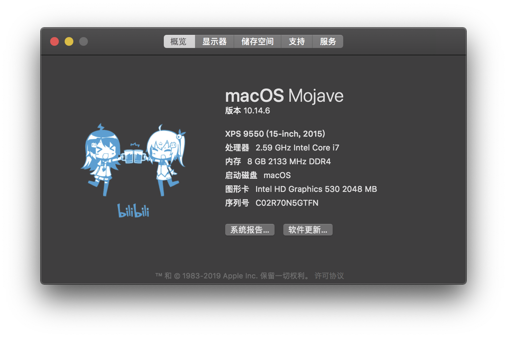

# XPS9550-Mojave

[黑手大佬](https://github.com/darkhandz/XPS-9550-Mojave)好久没更新了，咸鱼的我不会SSDT和DSDT，遇到相关问题真的自己搞不懂怎么改，所以换到了[wmchris大佬](https://github.com/wmchris/DellXPS15-9550-OSX/tree/10.14)的方案

### 配置:

* CPU:i7-6700HQ
* 内存:4GB DDR4 2133 *2
* 显卡:HD530 + GTX960m（然并卵）
* 屏幕:4K
* 网卡:DW1830
* 硬盘:960PRO 512GB

### 分区:

Win10和macOS双系统:

* macOS:100GB APFS
* Win10:100GB NTFS
* 资料盘:300+GB exFAT

（便于双系统读写，以4096簇大小格式化，虽然分区表会很大，但存小文件就不会占用太多空间）

### 版本:

* macOS:10.14.6(18G1012)
* CLOVER:5098
* AppleALC.kext:1.4.3
* VirtualSMC.kext:1.0.9
* Lilu.kext:1.3.9
* WhateverGreen.kext:1.3.4

### 备注:

耳机孔用的是[ComboJack](https://github.com/hackintosh-stuff/ComboJack)方案

10.14的小版本更新都可以无损进行。

1080P版本，修改config.plist  
Clover Configcurator中：  
**启动背景 -> UI比例** 2改为1  
文本编辑器：  
`<key>UIScale</key><integer>2</integer>` 2改为1

i5版本，（方法来自wmchris的教程，我自己没有i5）修改config.plist  
Clover Configcurator中：  
**显卡设置 -> ig-platform-id** 0x191b0000改为0x19160000 ；  
**设备设置 -> 属性 -> 设备 -> PciRoot(0x0)/Pci(0x2,0x0) -> AAPL,ig-platform-id** 00001B19改为00001619  
文本编辑器：  
`<key>ig-platform-id</key><string>0x191b0000</string>` 0x191b0000改为0x19160000 ；  
`<key>AAPL,ig-platform-id</key><data>AAAbGQ==</data>` AAAbGQ==改为AAAWGQ==