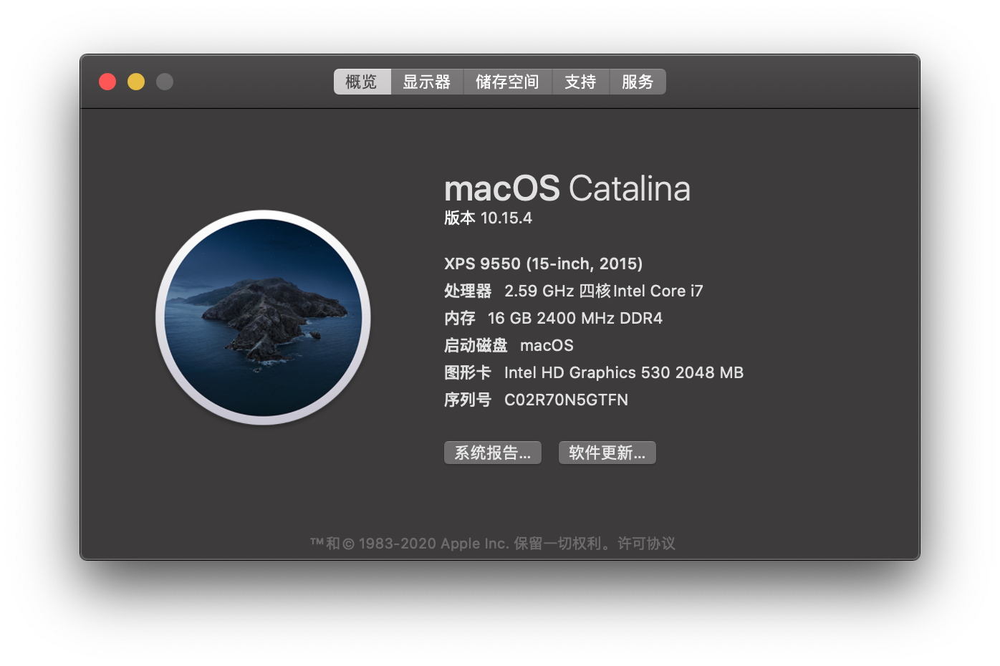

# XPS9550-Catalina

参考[黑手大佬](https://github.com/darkhandz/XPS15-9550-Catalina)和[wmchris大佬](https://github.com/wmchris/DellXPS15-9550-OSX)的方案，全新安装（才不是什么手贱把10.14删掉了）

### 配置:

* CPU:i7-6700HQ
* 内存:8GB DDR4 2400 *2
* 显卡:HD530 + GTX960m（然并卵）
* 屏幕:4K
* 网卡:DW1830
* 硬盘:960PRO 512GB

### 分区:

Win10和macOS双系统:

* macOS:100GB APFS
* Win10:100GB NTFS
* 资料盘:300+GB exFAT

### 版本:

| | | |
|:----:|:----:|----|
|系统|macOS|10.15.5|
| | |19F101|
|引导|CLOVER|5119|
|Kext|AirportBrcmFixup|2.0.7|
| |AppleALC|1.4.9|
| |BT4LEContinuityFixup|1.1.4|
| |BrcmPatchRAM|2.5.3|
| |CPUFriend|1.2.0|
| |FakePCIID|1.3.15|
| |HibernationFixup|1.3.3|
| |Lilu|1.4.5|
| |NVMeFix|1.0.2|
| |NoTouchID|1.0.3|
| |VirtualSMC|1.1.4|
| |VoodooI2C|2.4.3|
| |VoodooInput|1.0.6|
| |VoodooPS2Controller|2.1.5|
| |WhateverGreen|1.4.0|
| | | |

### 备注:

雷电3接口似乎可以用，但是没有设备测试，接手机可以热拔插  
耳机孔用的是[ComboJack](https://github.com/hackintosh-stuff/ComboJack)方案  
支持10.15的小版本更新（目前）  
Other中的icm文件是用DisplayCAL和Spyder5校准的4K色彩文件，macOS下放到`~/Library/ColorSync/Profiles/`目录下即可在显示器设置中使用  
 “关于本机” 机型名称在`/User/%用户名%/Library/Preferences/com.apple.SystemProfiler.plist`文件中修改  
重做了主题的图标，很奇怪，不识别以前的icns图标文件，但是png直接改后缀名的反而可以用

***

### 不同版本修改:

1080P版本，修改config.plist  
Clover Configcurator中：  
**启动背景 -> UI比例** 2改为1  
文本编辑器：  
`<key>UIScale</key><integer>2</integer>` 2改为1

i5版本，（方法来自wmchris的教程，我自己没有i5）修改config.plist  
Clover Configcurator中：  
**显卡设置 -> ig-platform-id** 0x191b0000改为0x19160000 ；  
**设备设置 -> 属性 -> 设备 -> PciRoot(0x0)/Pci(0x2,0x0) -> AAPL,ig-platform-id** 00001B19改为00001619  
文本编辑器：  
`<key>ig-platform-id</key><string>0x191b0000</string>` 0x191b0000改为0x19160000 ；  
`<key>AAPL,ig-platform-id</key><data>AAAbGQ==</data>` AAAbGQ==改为AAAWGQ==